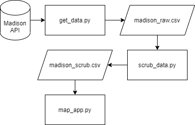

# Cul-de-sac Map

## Overview

<b>Cul-de-sac Map</b> is a fun example of Leaflet that maps properties on cul-de-sacs in Madison, WI.
 
* interactive map built in JavaScript (Leaflet.js)
* Python requests data from a couple of APIs and scrubs it into a GeoJSON for Leaflet

## Quickstart

	streamlit run python/map_app.py

## Example

## Data Summary

* 4,059 properties exist with a Cir street type and 3,267 with a Ct street type.
* Based on SchoolDigger data on standard scores, cul-de-sac properties exist in school districts with average standard scores that range from just 44.4 to 268.3 (perfect score being 300 = 100 (elementary) + 100 (middle) + 100 (high)).
* Only 161 cul-de-sac properties exist in school districts with a total score of 250 or better.
* 365 cul-de-sac properties exist in school districts with a total score of 195 or better.

## Process Diagram

## Requirements

1. Operating System 
This code has only been tested on Windows 10 Home (64-bit)

2. Infrastructure 
Python 3.8.5

3. Knowledge 
 * Streamlit
 * geopy
 * requests
 * Madison API

## Resources

* Madison, WI provides a very nice API here: 
[https://gis-countyofdane.opendata.arcgis.com/datasets/parcels](https://gis-countyofdane.opendata.arcgis.com/datasets/parcels)
* SchoolDigger Standard Score Data 
[https://www.schooldigger.com/go/WI/schoolrank.aspx?level=3](https://www.schooldigger.com/go/WI/schoolrank.aspx?level=3)
* Create GeoJSON 
[https://geoffboeing.com/2015/10/exporting-python-data-geojson/](https://geoffboeing.com/2015/10/exporting-python-data-geojson/)
